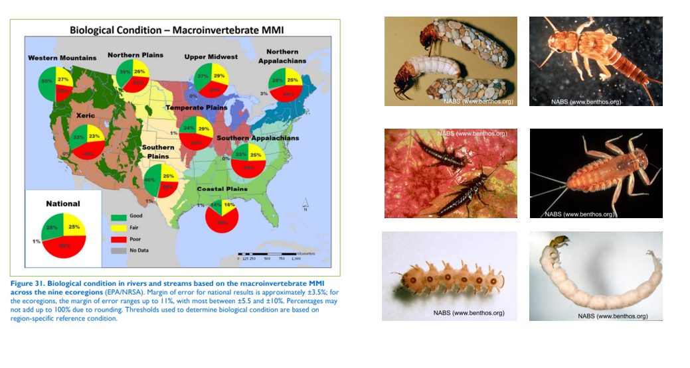

## Today's Talk

- A bit about myself, Western Ecology Division and EPA Research
- EPA National Aquatic Resource Surveys
- National mapping of aquatic condition
- StreamCat and LakeCat Products
- Some applications using these frameworks

## A Little About Me

* M.S. from PSU in Geography in 2001 
    + Advisor Dr. Keith Hadley
    + Biogeography focus
    + Thesis on forest successsion and dynamics on lahar deposit at Mt. St. Helens
* USFS PNW Research Station Forest Inventory and Analysis (FIA) program 2001-2003
* USFS Fire Sciences Lab - Fire History Project Assistant 2003-2005
* USFS Fire Sciences Lab - [LANDFIRE Project](https://www.landfire.gov/)
* US EPA Western Ecology Division, Freshwater Ecology Branch, 2005-Present

## EPA Structure

## EPA Regions

## EPA Office of Research and Development

## Western Ecology Division
* What We Do:
    + Research on terrestrial, freshwater and coastal systems
    + Develop tools to monitor and predict condition of these systems and effect on human health
    + Use a 'Watershed Epidemiology' approach to develop tools to help achieve sustainable, resilient watersheds
    

## NARS

* The National Aquatic Resource Surveys (NARS) are collaborative programs between EPA, states, and tribes designed to assess the quality of the nation's:
    + coastal waters
    + lakes and reservoirs 
    + rivers and streams
    + wetlands 

## NARS

## NARS Probability Surveys

* In probability surveys:
    + Sites are selected randomly
    + Each site represents a specific portion of the total resource or population of interest
    + Results can be extrapolated to the entire population

- We can make unbiased assessments of condition of entire resource across large areas w/out monitoring every waterbody

## Sample Frames

## Sample Frames

* Need to Assign:
  - State
  - Ecoregions
  - Census Urban Boundaries
  - Land Ownership
  - Strahler Order to rivers
  - Elevation to lakes
  - NOAA Salinity zone to estuaries
  - ....
  

- These assignments to frame elements necessary to stratify our samples and to make specific population estimates

    
## An Example Design

- An example design where we have strata (states) that we can extrapolate to, and we create an unequal probability of selection based on stream order (select more sites on smaller or larger streams for instance)

## Reporting and Research

- Able to report on condition and apply national scale consistent data in national scale research products - 100+ peer-reviewed journal articles and counting that have have applied the NARS data

## National and Ecoregional Condition Assessments

## National and Ecoregional Condition Assessments

## National / Regional Assessment vs. Predicted Condition Everywhere

## Gather Upstream Landscape Information at Sampled Locations

## Build Empirical Relationships of Watershed and Instream Conditions

## Apply Empirical Models Back to Landscape to Produce Maps of Predicted Aquatic Condition

## The Stream-Catchment Dataset (StreamCat)

## The Stream-Catchment Dataset (StreamCat)

* StreamCat is:
  - A dataset of 500+ landscape metrics 
  - Summarized for ~ 2.65 million stream segements and associated catchments in CONUS
  - Served as comma-delimited files by NHDPlus hydro-region or by state
  
  

## The Stream-Catchment Dataset (StreamCat)

## NHDPlus Framework

- NHD is our line network of streams we use
- Available at 2 primary resolutions - 24k and 100k
- 100k resolution combined with digital elevation data and a few other things used to create 'value added' project of NHDPlus
- We use NHDPlus version 2 which is 100k resolution
- The big addition is that NHDPlus defines 'local drainage' areas for every stream reach, which they call 'catchments'

## NHDPlus Framework

- We have network topology (from-to relationships) for each flowline
- We have local catchments defined for each stream segment
- So we have the ability to overlay and move catchment landscape summaries from upstream to downstream

- We create summaries for the watersheds of each reach / catchment by performing zonal statitics of landscape data pixels for each catchment, and then using a tree-walking algorithm in Python to convert topology tables to numpy arrays for fast processing

## StreamCat Framework {.columns-2}

* Landscape information summarized by:
  - Catchment (local drainage)
  - Riparian buffer (for some metrics)
  - Watershed

## StreamCat Framework

## StreamCat Watershed Metrics

- Able to map full watershed metrics for things such as National Land Cover Dataset % Urbanization in watershed for all roughly 2 and a half million streams in NHDPlus
- On first glance it looks much like just map of % urban in general, but zooming in to places you can see the attenuation of urban effect on the watershed for instance in the S. Platte draining eastward from the greater Denver metropolitan area

## LakeCat

- Developed and earlier this year published a corollary dataset to StreamCat focused for lake watersheds using waterbody features in the NHD

## LakeCat

- 1/3 of NHDPlus lakes are 'on-network' and we can use StreamCat results - 2/3 are 'off-network' and had to have local catchments delineated and network topology (from-to) relationships built

## Examples / Applications

## Examples / Applications - Watershed Integrity
- 'Watershed Epidemiology' 
-  Use human health perspective to estimate risks based on behavior (e.g. diet, exercies, smoking)
-  Apply risk / behavior model to factors influencing watershed health

## Examples / Applications - Watershed Integrity
- **Six key functions** needed for a watershed to have 'integrity' (Flotemersch et al. 2015):

1. Hydrologic regulation
2. Regulation of water chemistry
3. Sediment regulation
4. Hydrologic connectivity
5. Temperature regulation
6. Habitat provision

- We identified landscape metrics we'd accumulated in StreamCat, as well as additional metrics we accumulated, that together were a best approximation for these six key functions

## Examples / Applications - Index of Watershed Integrity (IWI)

## Examples / Applications - Applying the IWI in the Western Balkans

- Kelsey Aho, a post-doc at EPA, worked on partnership project between the EPA and Environmental Center for Central and Eastern Europe to adopt the IWI for aiding the sustainable development of the western Balkans transboundary river and lake basins.  
- She adapted the six functional components used in the US IWI to western Balkans topography, land use, and data availability, and I implemented our StreamCat approach using their stream / basin framework to accumulate a new set of landscape metrics to inform the functional components of the IWI

## Examples / Applications - Applying the IWI in SW Alaska

- Kelsey Aho also applied the IWI to the Masanuska-Susitna basin in SW Alaska
- Again modified the six functional components to fit a different landscape and data constraints
- This was a pilot use of the new USGS-EPA high resolution National Hydrograpy Dataset Plus where I had to again apply our StreamCat methodology to a new hydrologic framework

## Design Approach for Projects

* *Transparency*    
  - Primarily open source tools in Python and R
  - Code published on GitHub repositories
  - Documentation, QA files, and metadata on project ftp sites
* *Quality Assurance*
  - Standardized QA protocol for all landscape layers
  - QA documentated online in R Markdown showing QA code and results

## Design Approach for Projects

* *Reproducibility*
  - Use of 'control tables' and functional code
  - Use of R Markdown and knitr to produce documentation
  - Use of git version control for shared code editing
* *Ease of Access*
  - Data available as .csv files on public ftp server
  - Results all have unique IDs to directly match to NHDPlus (in US)

## Other

* Nitrogen Drivers work?
* Endangered Species / Pesticide modeling for detail?
* micromap R package?
* Water residence / Isotope (brookes) and lake drawdown (fergus)?
* R spatial workshop teaching?
* GEE / Neural Networks for deriving new landscape information with bearing on aquatic condition

## Acknowledgments

* Ryan Hill, Oak Ridge Institute for Science and Education (ORISE)
* Scott Leibowitz, EPA
* Tony Olsen, EPA
* Rick Debbout, CSRA Inc.
* Darren Thornbrugh, Nationial Park Service
* Zach Johnson, University of Washington
* Kelsey Aho, University of Alaska Fairbanks

## Questions

