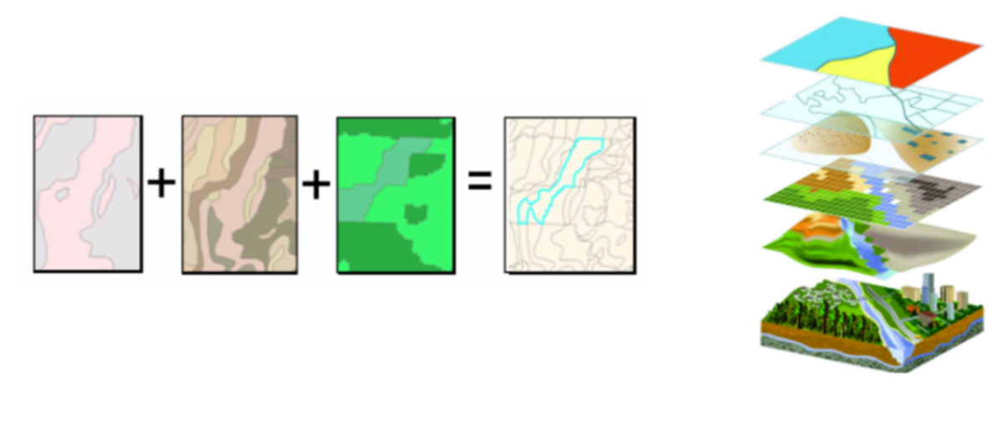
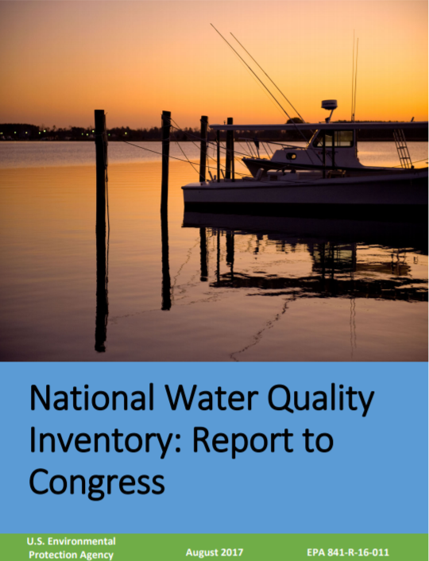
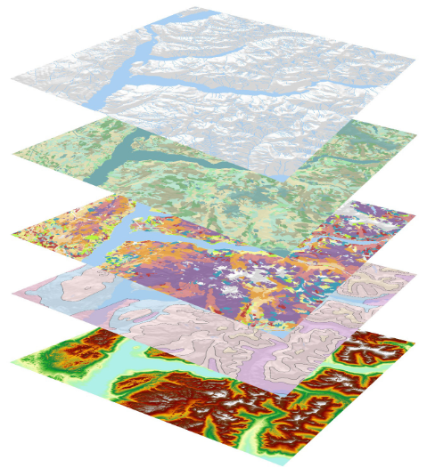
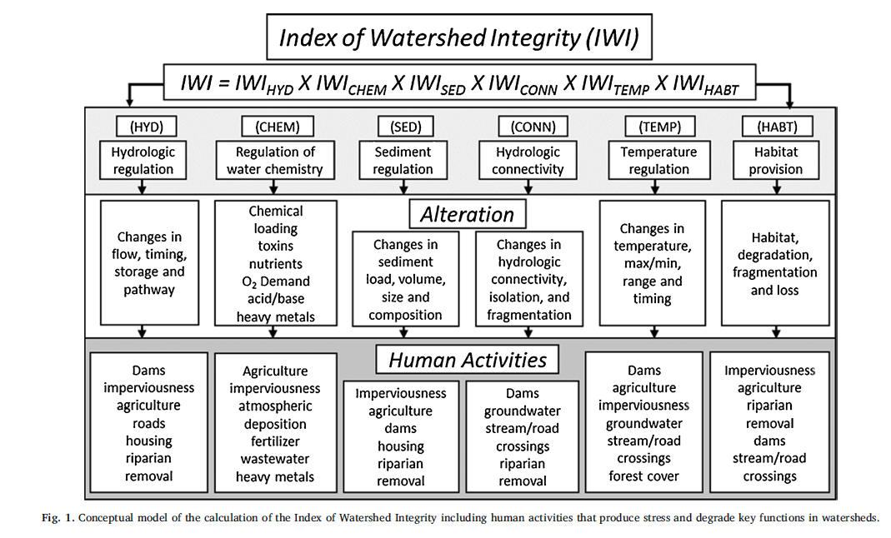

## Today's Talk

- A bit about myself, Western Ecology Division and EPA Research
- EPA National Aquatic Resource Surveys
- StreamCat and LakeCat Data Products
- National application of data to map 'Watershed Integrity'

## A Little About Me

* M.S. from PSU in Geography in 2001 
    + Advisor Dr. Keith Hadley
    + Biogeography focus
    + Thesis on forest successsion and dynamics on lahar deposit at Mt. St. Helens
* USFS PNW Research Station Forest Inventory and Analysis (FIA) program 2001-2003
* USFS Fire Sciences Lab - Fire History Project Assistant 2003-2005
* USFS Fire Sciences Lab - [LANDFIRE Project](https://www.landfire.gov/)
* US EPA Western Ecology Division, Freshwater Ecology Branch, 2008-Present

## EPA Structure

## EPA Office of Research and Development

## Western Ecology Division

* Research Lab within EPA Office of Research and Development
* What We Do:
    + Research on terrestrial, freshwater and coastal systems
    + Develop tools to monitor and predict condition of these systems
    + Develop tools to help achieve sustainable, resilient watersheds
    

## Western Ecology Division
* What I Do:
    + Mapping
    + Data Wrangling
    + Data Visualization
    + Spatial Analysis to support research goals  
    

## EPA National Aquatic Resource Surveys

## EPA National Aquatic Resource Surveys

* The National Aquatic Resource Surveys (NARS) are collaborative programs between EPA, states, and tribes designed to assess the quality of the nation's:
    + coastal waters
    + lakes and reservoirs 
    + rivers and streams
    + wetlands 

## EPA National Aquatic Resource Surveys

## EPA National Aquatic Resource Surveys

1. What percent of nation's water are in good, fair or poor condition?

## EPA National Aquatic Resource Surveys

1. What percent of nation's water are in good, fair or poor condition?
2. What is the relative importance of keys stressors such as nutrients or habitat alteration?

## EPA National Aquatic Resource Surveys

1. What percent of nation's water are in good, fair or poor condition?
2. What is the relative importance of keys stressors such as nutrients or habitat alteration?
3. Is water quality getting better or worse?

## NARS - Condition Reporting

## NARS - Sample Design

* Same idea as political polling
* Subset of sites have to represent aquatic resource nationally

## NARS - Sample Design

1. Sites are selected randomly

## NARS - Sample Design

1. Sites are selected randomly
2. Each site represents a specific portion of the total resource or population of interest

## NARS - Sample Design

1. Sites are selected randomly
2. Each site represents a specific portion of the total resource or population of interest
3. Results of sampling can be extrapolated to the entire population

## NARS - Reference Sites

* Identify reference sites in “least disturbed” condition in ecological regions
* Least disturbed <> pristine!

## NARS - Representing the Target Population

## NARS - GIS Attributes  {.columns-2}

* Need to Assign:
    - State
    - Ecoregions
    - Census Urban Boundaries
    - Land Ownership
    - Strahler Order to rivers
    - Elevation to lakes
    - NOAA Salinity zone to estuaries
    - ....

## NARS - GIS Features + Probability Design

## NARS - Site Sampling for Suite of Indicators

## NARS - Condition Reporting

## Reporting and Research

## NARS - Condition Reporting

## National / Regional Assessment vs. Predicted Condition Everywhere

## Gather Upstream Landscape Information at Sampled Locations

## Build Empirical Relationships of Watershed and Instream Conditions

## Apply Empirical Models Back to Landscape to Produce Maps of Predicted Aquatic Condition

## The Stream-Catchment Dataset (StreamCat)

## The Stream-Catchment Dataset (StreamCat) {.columns-2}

* StreamCat is:
  - A dataset of 500+ landscape metrics 
  - Summarized for ~ 2.65 million stream segements and associated catchments in CONUS
  - Served as comma-delimited files by NHDPlus hydro-region or by state
  

## The Stream-Catchment Dataset (StreamCat)

## NHDPlus Framework

## NHDPlus Framework

## StreamCat Framework

## StreamCat Watershed Metrics

## StreamCat Application

## LakeCat

## LakeCat

## Application of LakeCat

## Mapping Watershed Integrity

## Watershed Integrity

-  Use human health perspective to estimate risks based on behavior (e.g. diet, exercies, smoking)
-  Apply risk / behavior model to factors influencing watershed health

## Watershed Integrity

**Six key functions** needed for a watershed to have 'integrity' (Flotemersch et al. 2015)

## Index of Watershed Watershed Integrity

## Index of Catchment and Watershed Integrity

## Index of Watershed Integrity

## Regional Application of Index of Watershed Integrity 

## Applications - Prioritizing Restoration

## Applications - Prioritizing Restoration Using Predicted Biological Condition and ICI / IWI

## Applications - Prioritizing Restoration Using Predicted Biological Condition and ICI / IWI

## Acknowledgments

* Ryan Hill, Oak Ridge Institute for Science and Education (ORISE)
* Scott Leibowitz, EPA
* Tony Olsen, EPA
* Rick Debbout, CSRA Inc.
* Darren Thornbrugh, Nationial Park Service
* Zach Johnson, University of Washington
* Kelsey Aho, University of Alaska Fairbanks

*The views expressed here are my own, and do not necessarily reflect those of the U.S. Environmental Protection Agency.*

## Questions

## Other Work

* Data Visualization - [Linked Micromaps](https://www.jstatsoft.org/article/view/v063i02)
* R spatial workshop teaching:
    - [AWRA GIS R Spatial Workshop](https://mhweber.github.io/AWRA_GIS_R_Workshop/)
    - [EPA R Workgroup R Spatial Workshop](https://mhweber.github.io/R-User-Group-Spatial-Workshop-2018/)
    - [GIS in Action R Spatial Workshop](https://mhweber.github.io/gis_in_action_r_spatial/)

## Other Work    
* Current part time detail with EPA Office of Pesticide Programs
    - Geospatial / coding support for:
        + Spatial Aquatics Model
        + Endangered Species / Pesticide Modeling
* Geospatial work with other scientists addressing:
    - [Nitrogen inputs to streams in US](https://www.sciencedirect.com/science/article/pii/S0048969718316401)
    - [Estimating inflow and water residence time for lakes in US via stable isotopes](https://aslopubs.onlinelibrary.wiley.com/doi/abs/10.4319/lo.2014.59.6.2150)